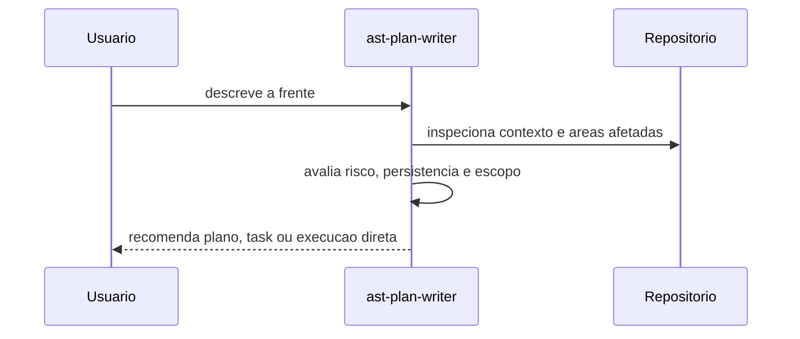
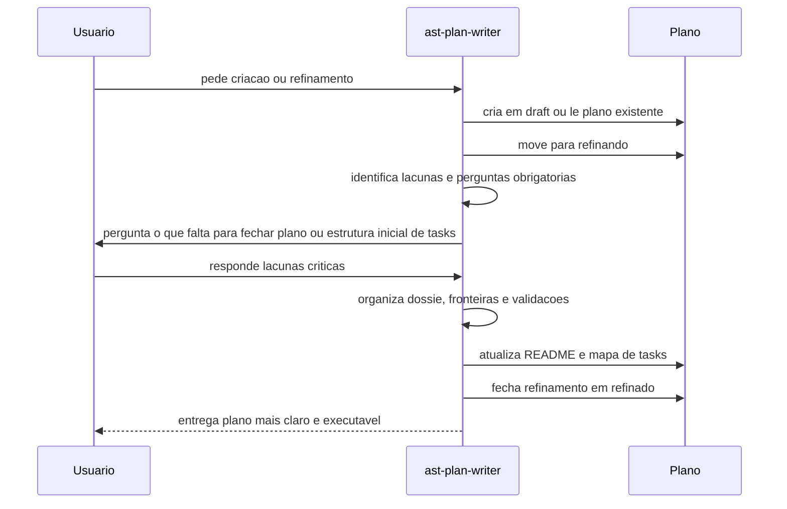
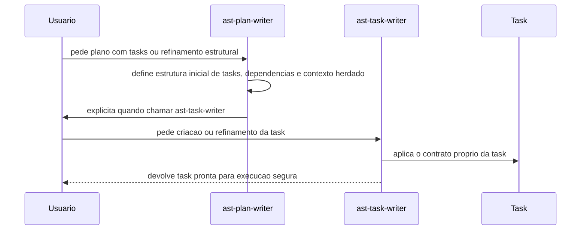

# Fluxos de sequencia da ast-plan-writer

## Avaliar se merece plano

Quando ainda existe duvida entre plano, task ou execucao direta.

## Criar ou refinar plano

Quando a frente merece um plano novo ou quando um plano existente precisa ser endurecido.

## Handoff para ast-task-writer

Quando o plano ja foi aberto, suas tasks ja pertencem ao pacote e a manutencao deve sair desta skill.

