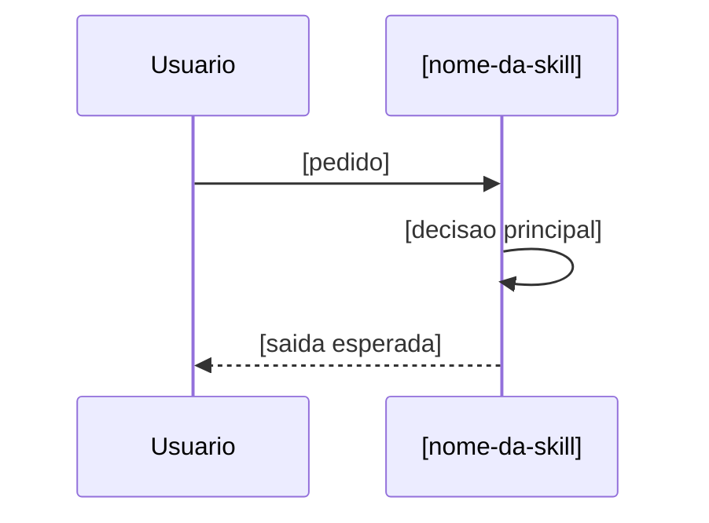

# Template de pacote de skill

## Estrutura minima

```text
.claude/skills/[nome-da-skill]/
├── SKILL.md
├── agents/
│   └── openai.yaml
├── references/
│   ├── pattern-[tema-principal].md
│   ├── sequence-workflows.md
│   └── version-history.md
├── assets/
│   └── template-[artefato-principal].md
└── scripts/
    └── [script-opcional]
```

## Template de `SKILL.md`

```md
---
name: [nome-da-skill]
description: [o que a skill faz, quando usar e qual tipo de problema resolve]
compatibility: [opcional, apenas se houver requisito real de ambiente]
metadata:
  author: [agents-studio | local/application]
  last_updated: AAAA-MM-DD HH:MM
  version: "1.0.0"
---

# [nome-da-skill]

## Inicio rapido

1. [como interpretar o pedido]
2. [o que inspecionar primeiro]
3. [como fechar a execucao]

## O que esta skill faz

- [...]

## Quando usar

- [...]

## Quando nao usar

- [...]

## Acoes que esta skill interpreta

| Acao | Quando usar | Entradas esperadas | Saidas esperadas |
|------|------|------|------|
| `criar` | [...] | [...] | [...] |
| `incorporar-conhecimento` | [...] | [...] | [...] |

## Entradas tipicas

- [...]

## Workflow recomendado

1. [...]
2. [...]
3. [...]

## Estrutura minima esperada

- [...]

## Versionamento leve

- [...]

## Referencias sob demanda

- `references/pattern-[tema-principal].md`
- `references/sequence-workflows.md`
- `references/version-history.md`
- `assets/template-[artefato-principal].md`
- `scripts/[script-opcional]`

## Limites e seguranca

- [...]
```

## Template de `agents/openai.yaml`

```yaml
display_name: "Nome humano"
short_description: "Resumo curto e direto"
default_prompt: "Use $[nome-da-skill] para [acao principal]."
```

## Template de `pattern`

```md
---
title: Pattern de [tema]
description: [o que este pattern padroniza]
metadata:
  author: [agents-studio | local/application]
  last_updated: AAAA-MM-DD HH:MM
  version: "1.0.0"
---

# Pattern de [tema]

## Objetivo

[...]

## Regras centrais

- [...]
```

## Template de `version-history.md`

```md
---
title: Historico de versao da [nome-da-skill]
description: [como a skill evolui entre base do framework e customizacoes locais]
metadata:
  author: [agents-studio | local/application]
  last_updated: AAAA-MM-DD HH:MM
  version: "1.0.0"
---

# Historico de versao da [nome-da-skill]

## Politica resumida

- `1.0.0` -> base inicial
- `-local` -> customizacao local posterior

## Registro

| Data | Versao | Base | Tipo | Resumo |
|------|------|------|------|------|
| AAAA-MM-DD | 1.0.0 | 1.0.0 | framework | versao inicial |
```

## Template de `sequence-workflows.md`

```md
---
title: Fluxos de sequencia da [nome-da-skill]
description: Explicita os fluxos principais por acao da skill com diagramas Mermaid curtos.
metadata:
  author: [agents-studio | local/application]
  last_updated: AAAA-MM-DD HH:MM
  version: "1.0.0"
---

# Fluxos de sequencia da [nome-da-skill]

## [acao principal]

[quando esse fluxo se aplica]


```
