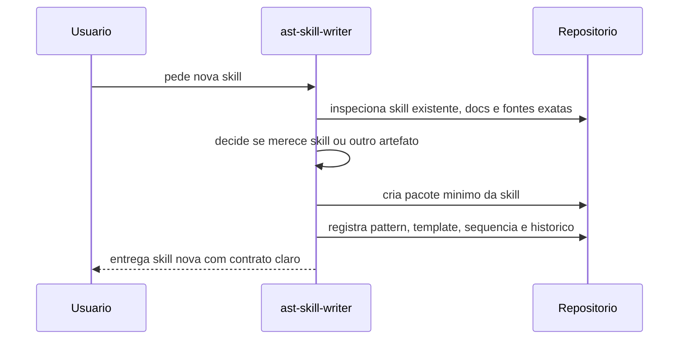
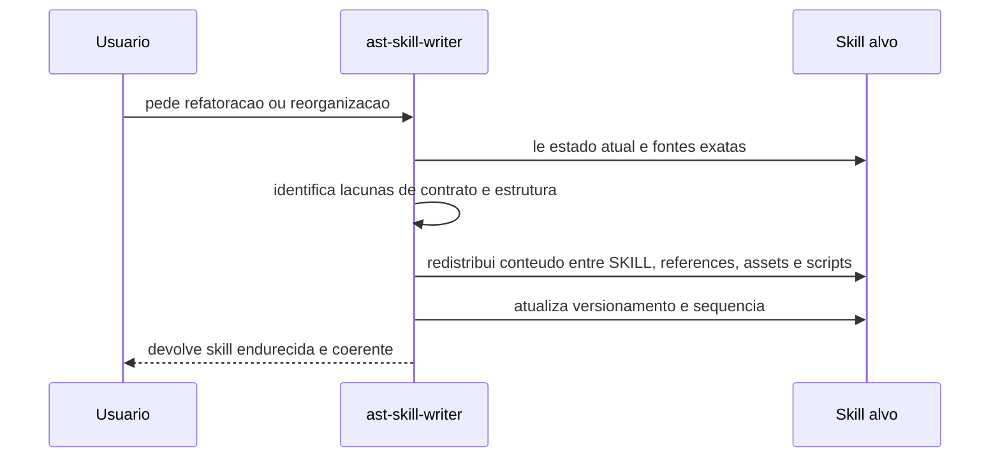
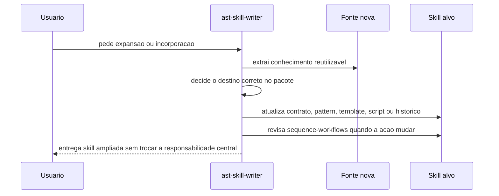

# Fluxos de sequencia da ast-skill-writer

## Objetivo

Registrar de forma visual e curta como a skill deve operar nas suas acoes principais, preservando um passo a passo facil de revisar sem duplicar o `SKILL.md`.

## Criar

Quando a capacidade ainda nao existe como skill e ha recorrencia real.

## Refatorar ou reorganizar

Quando a skill existe, mas precisa ganhar clareza, estrutura ou aderencia ao contrato atual.

## Expandir ou incorporar conhecimento

Quando a skill atual deve absorver capacidade compativel ou aprendizado recorrente vindo de docs, conversa, execucao ou feedback.

