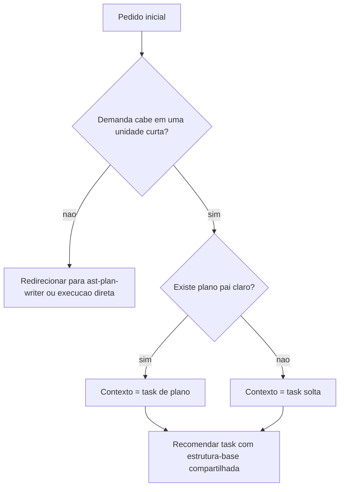
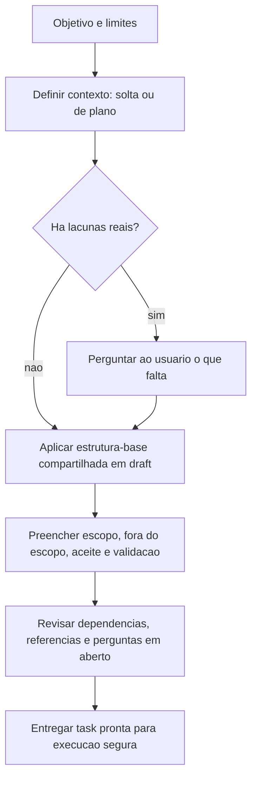
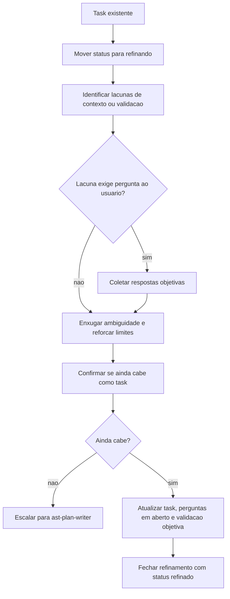
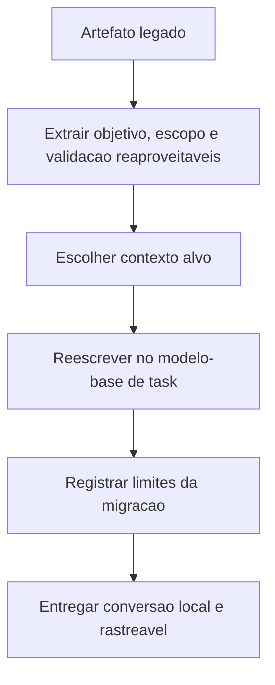

# Sequence workflows da ast-task-writer

## Avaliar se merece task

```mermaid
flowchart TD
    A[Pedido inicial] --> B{Demanda cabe em uma unidade curta?}
    B -- nao --> C[Redirecionar para ast-plan-writer ou execucao direta]
    B -- sim --> D{Existe plano pai claro?}
    D -- sim --> E[Contexto = task de plano]
    D -- nao --> F[Contexto = task solta]
    E --> G[Recomendar task com estrutura-base compartilhada]
    F --> G
```

## Criar task

```mermaid
flowchart TD
    A[Objetivo e limites] --> B[Definir contexto: solta ou de plano]
    B --> C{Ha lacunas reais?}
    C -- sim --> D[Perguntar ao usuario o que falta]
    C -- nao --> E[Aplicar estrutura-base compartilhada em draft]
    D --> E
    E --> F[Preencher escopo, fora do escopo, aceite e validacao]
    F --> G[Revisar dependencias, referencias e perguntas em aberto]
    G --> H[Entregar task pronta para execucao segura]
```

## Refinar task

```mermaid
flowchart TD
    A[Task existente] --> B[Mover status para refinando]
    B --> C[Identificar lacunas de contexto ou validacao]
    C --> D{Lacuna exige pergunta ao usuario?}
    D -- sim --> E[Coletar respostas objetivas]
    D -- nao --> F[Enxugar ambiguidade e reforcar limites]
    E --> F
    F --> G[Confirmar se ainda cabe como task]
    G --> H{Ainda cabe?}
    H -- nao --> I[Escalar para ast-plan-writer]
    H -- sim --> J[Atualizar task, perguntas em aberto e validacao objetiva]
    J --> K[Fechar refinamento com status refinado]
```

## Migrar legado pontual

```mermaid
flowchart TD
    A[Artefato legado] --> B[Extrair objetivo, escopo e validacao reaproveitaveis]
    B --> C[Escolher contexto alvo]
    C --> D[Reescrever no modelo-base de task]
    D --> E[Registrar limites da migracao]
    E --> F[Entregar conversao local e rastreavel]
```
