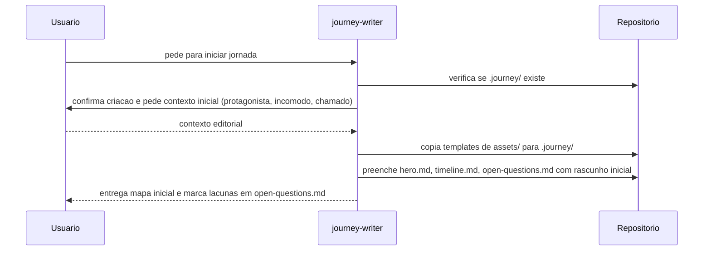
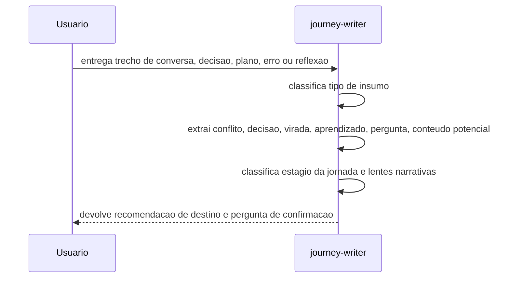
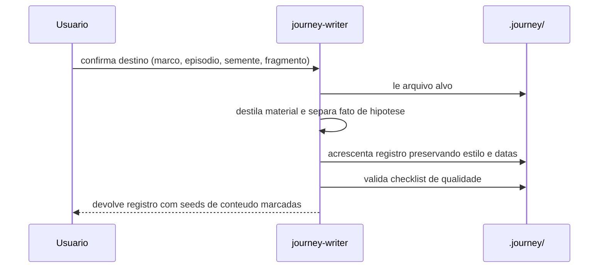
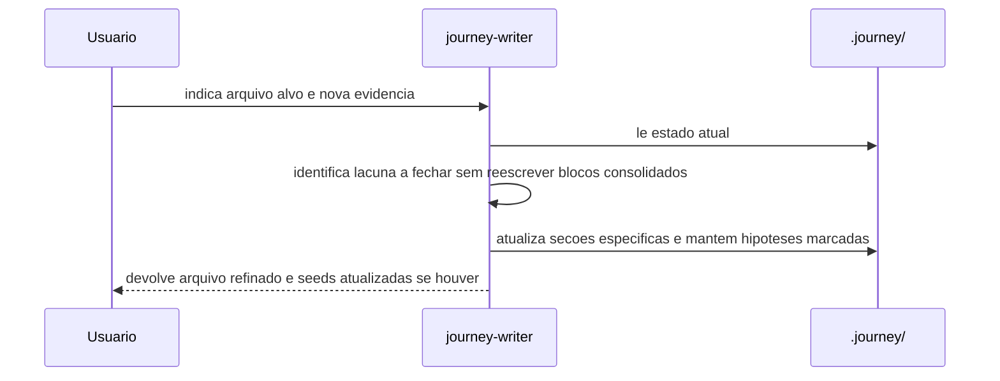
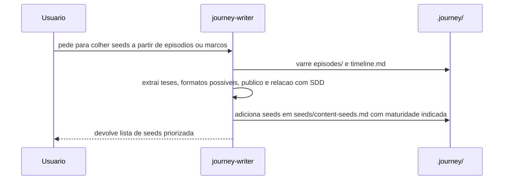

# Fluxos de sequencia da journey-writer

## Objetivo

Registrar visualmente como a skill opera nas acoes principais, preservando passo a passo facil de revisar sem duplicar `SKILL.md`.

## Inicializar

Quando `.journey/` ainda nao existe ou esta incompleto.

## Analisar insumo

Quando o usuario traz material bruto e quer saber onde registrar.

## Registrar

Quando o destino editorial ja esta claro.

## Refinar

Quando `hero.md`, episodio existente ou `open-questions.md` precisa amadurecer.

## Colher conteudo

Quando registros existentes ja tem material suficiente para virar oferta publica.

