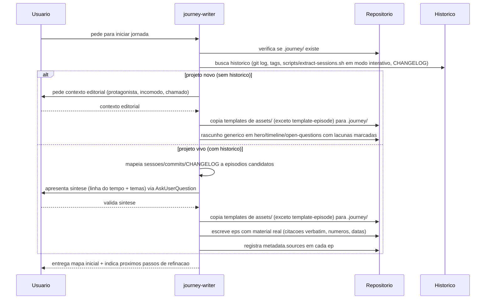
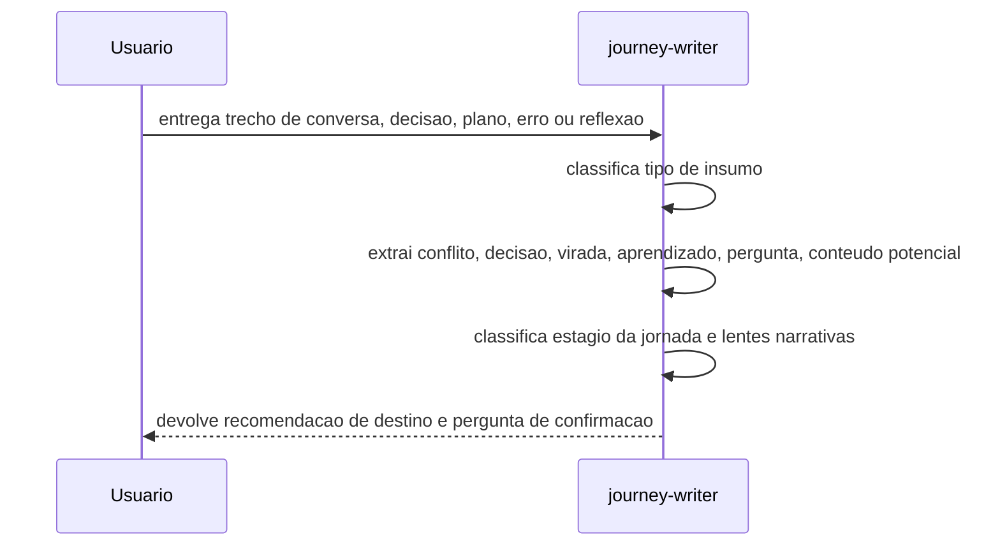
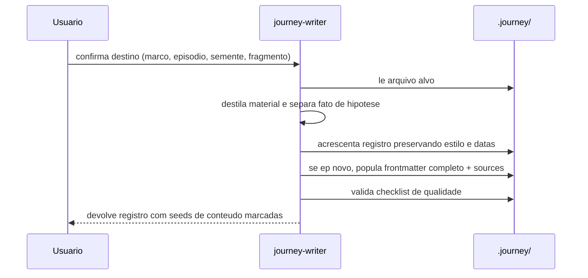
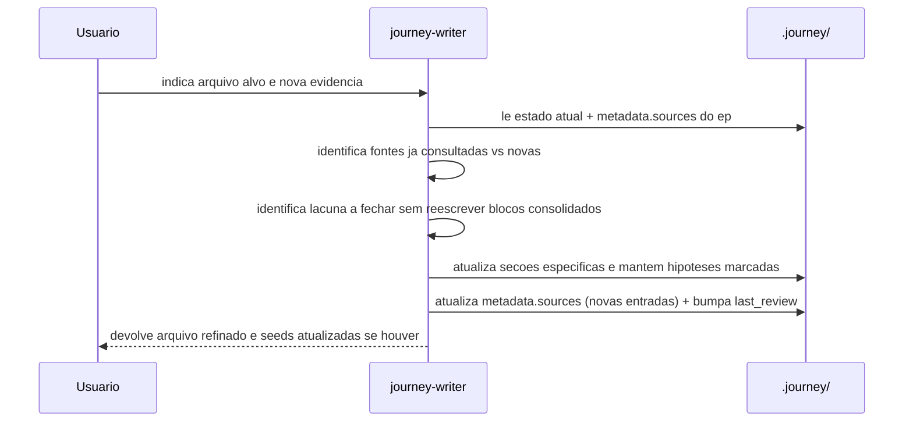
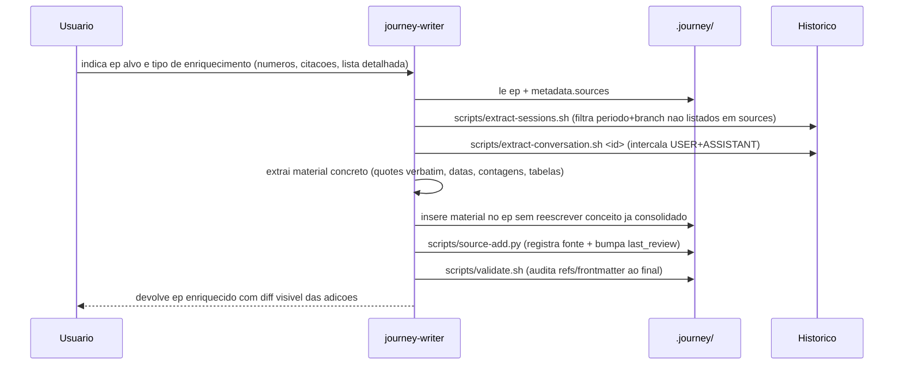
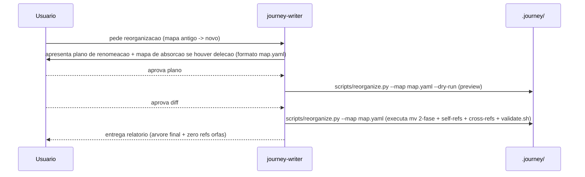
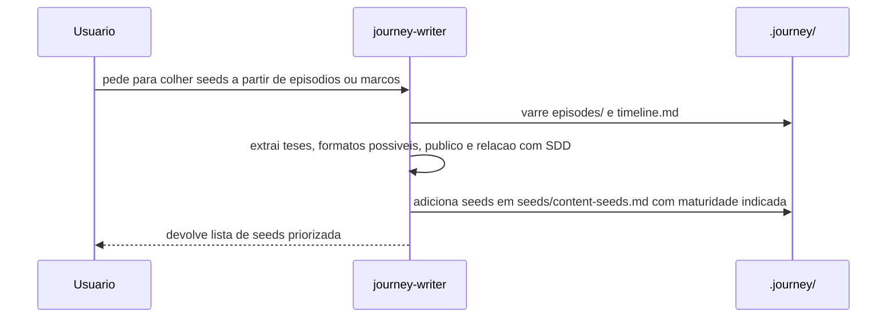
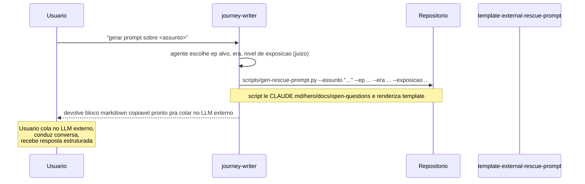
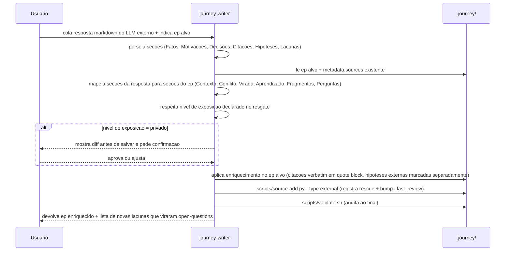
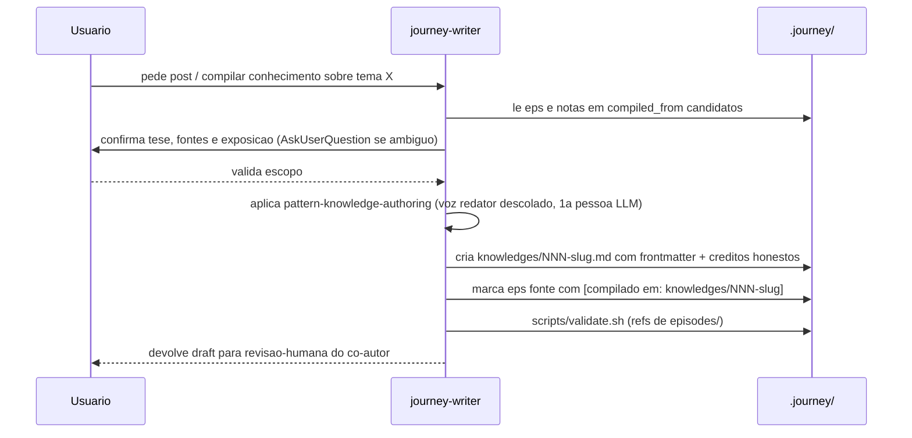

# Fluxos de sequencia da journey-writer

## Objetivo

Registrar visualmente como a skill opera nas acoes principais, preservando passo a passo facil de revisar sem duplicar `SKILL.md`.

## Convencao sobre scripts

A partir de 1.3.0, varios passos chamam scripts deterministas em `scripts/`. Quando um passo aparece como `S->S: <descricao>` mas existe script equivalente, preferir chamar o script. Mapa completo em [`pattern-scripts.md`](./pattern-scripts.md).

## Inicializar (com ramificacao por historico)

Quando `.journey/` ainda nao existe ou esta incompleto. Caminho A (projeto novo, sem historico) e Caminho B (projeto vivo, com sessoes/commits/CHANGELOG).



## Analisar insumo

Quando o usuario traz material bruto e quer saber onde registrar.



## Registrar

Quando o destino editorial ja esta claro.



## Refinar

Quando `hero.md`, episodio existente ou `open-questions.md` precisa amadurecer.



## Enriquecer

Quando episodio existente esta raso e precisa ganhar numeros, citacoes ou tabelas. Diferente de `refinar` (que cobre lacuna conceitual): `enriquecer` adiciona densidade objetiva.



## Reorganizar

Quando numeracao cronologica precisa mudar (novo ep no meio, fusao, divisao). Detalhe em `pattern-renumeration-safe.md`.



## Validar

Quando ha suspeita de refs quebradas, frontmatter incompleto ou sources defasados.

```mermaid
sequenceDiagram
    participant U as Usuario
    participant S as journey-writer
    participant J as .journey/
    U->>S: pede validacao da camada
    S->>J: scripts/validate.sh (executa em ms; substitui acao inteira)
    Note over S,J: refs orfas + frontmatter incompleto + last_review > 30d + title vs filename + eps sem sources
    S-->>U: relatorio categorizado (exit 0 = limpo, exit 1 = pendencias)
```

## Colher conteudo

Quando registros existentes ja tem material suficiente para virar oferta publica.



## Gerar prompt externo

Quando ha memoria que so o usuario tem (ou que precisa de outro modelo pra destravar). Skill gera prompt parametrizado pra usuario levar a ChatGPT, Claude.ai ou Gemini.



## Absorver resgate externo

Quando usuario volta com resposta estruturada vinda do LLM externo.



## Compilar conhecimento

Quando material maduro em episodios/notas deve virar post de blog em `knowledges/` com voz de agente e co-autoria explicita.


